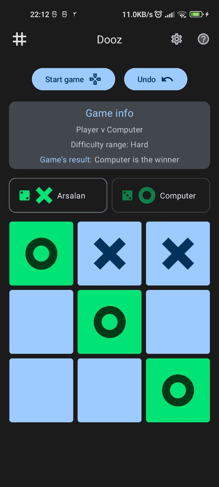

# Dooz/Tic-Tac-Tao

Dooz or Tic-Tac-Tao is a simple pen-and-paper game. I created this implementation using Kotlin and
Jetpack Compose for Android devices.

---

| Icon |                Item                 |
|:----:|:-----------------------------------:|
|  📺  |       [**Preview**](#Preview)       |
|  📱  | [**Compatibility**](#Compatibility) |
|  💻  |         [**Usage**](#Usage)         |
|  📩  |      [**Download**](#Download)      |
|  📋  |      [**Features**](#Features)      |
|  🧾  |     [**Changelog**](#Changelog)     |
|  ⚖️  |       [**License**](#License)       |

---

## Preview

## Compatibility

**SDK21+** or **Android 5.0+**

## Usage

Just play it!

## Download

[](https://apps.obtainium.imranr.dev/redirect?r=obtainium://app/%7B%22id%22%3A%22io.github.yamin8000.dooz%22%2C%22url%22%3A%22https%3A%2F%2Fgithub.com%2Fyamin8000%2FDooz%22%2C%22author%22%3A%22yamin8000%22%2C%22name%22%3A%22Dooz%22%2C%22preferredApkIndex%22%3A0%2C%22additionalSettings%22%3A%22%7B%5C%22includePrereleases%5C%22%3Afalse%2C%5C%22fallbackToOlderReleases%5C%22%3Atrue%2C%5C%22filterReleaseTitlesByRegEx%5C%22%3A%5C%22%5C%22%2C%5C%22filterReleaseNotesByRegEx%5C%22%3A%5C%22%5C%22%2C%5C%22verifyLatestTag%5C%22%3Afalse%2C%5C%22dontSortReleasesList%5C%22%3Afalse%2C%5C%22useLatestAssetDateAsReleaseDate%5C%22%3Afalse%2C%5C%22releaseTitleAsVersion%5C%22%3Afalse%2C%5C%22trackOnly%5C%22%3Afalse%2C%5C%22versionExtractionRegEx%5C%22%3A%5C%22%5C%22%2C%5C%22matchGroupToUse%5C%22%3A%5C%22%5C%22%2C%5C%22versionDetection%5C%22%3Atrue%2C%5C%22releaseDateAsVersion%5C%22%3Afalse%2C%5C%22useVersionCodeAsOSVersion%5C%22%3Afalse%2C%5C%22apkFilterRegEx%5C%22%3A%5C%22%5C%22%2C%5C%22invertAPKFilter%5C%22%3Afalse%2C%5C%22autoApkFilterByArch%5C%22%3Atrue%2C%5C%22appName%5C%22%3A%5C%22%5C%22%2C%5C%22shizukuPretendToBeGooglePlay%5C%22%3Afalse%2C%5C%22allowInsecure%5C%22%3Afalse%2C%5C%22exemptFromBackgroundUpdates%5C%22%3Afalse%2C%5C%22skipUpdateNotifications%5C%22%3Afalse%2C%5C%22about%5C%22%3A%5C%22%5C%22%2C%5C%22refreshBeforeDownload%5C%22%3Afalse%7D%22%2C%22overrideSource%22%3A%22GitHub%22%7D)

- ~~Bazaar: [here](https://cafebazaar.ir/app/io.github.yamin8000.dooz)~~

## Features

### Technical

- Jetpack Compose
- Material3 and Dynamic Color

### Game

- Variable game board grid size from three-by-three to nine-by-nine (Larger than nine-by-nine is
  simply ridiculous and unplayable in mobile phones)
- Variable game ai difficulty (easy, medium, hard)

### Variations

#### Simple Game

The Simple game is the most simple variation of Tic-tac-tao with a three-by-three grid with two
players. The player who succeeds in placing three of their marks in horizontal, vertical, or
diagonal is the winner.

##### Simple Game AI

Currently, in hard mode, AI uses a strategy rather than an AI search algorithm like MinMax. This
strategy consists of these steps: Win, Block, Fork, Block Fork, Center Play, Corner Play, and Side
Play.

Strategy's source: Flexible Strategy Use in Young Children's Tic-Tac-Toe by Kevin Crowley, Robert S.
Siegler

[More info on the strategy here](https://onlinelibrary.wiley.com/doi/abs/10.1207/s15516709cog1704_3)

In Easy difficulty, AI plays a random empty cell in the grid. In Medium difficulty, AI chooses
between Easy difficulty and Hard difficulty for each move based on a 50/50 chance.

## Changelog

- [Releases](https://github.com/yamin8000/Dooz/releases)

## License

> Owl is licensed under the **[GNU General Public License v3.0](./LICENSE)**  
> Permissions of this strong copyleft license are conditioned on making  
> available complete source code of licensed works and modifications,  
> which include larger works using a licensed work, under the same  
> license. Copyright and license notices must be preserved. Contributors  
> provide an express grant of patent rights.
